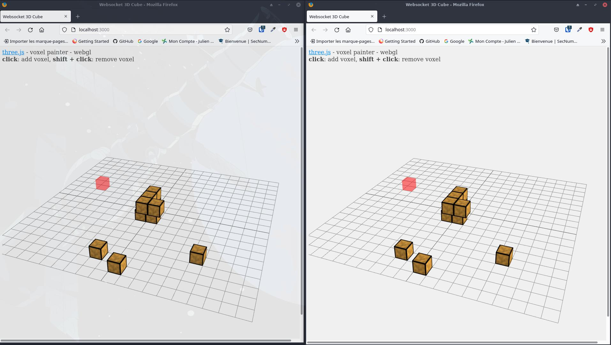

## Introduction a Three.js et Websocket


Projet multijouer, manipulation de blocs 3D avec camera interactifs

Ce projet a pour but découvrir les rudiments de Three.js avec socket.io



## Comment l'utiliser ? 

#### 1. Télécharger le repo sur votre machine

```bash
git clone <url du repo>
```

#### 2. Prérequis en local
-  Javascript
-  Nodemon


#### 3. Installez les dépendances 

```bash
npm install 
```  

#### 4. Lancer l'application

- Exécuter `npm run start` pour lancer l'application.
- Ouvrir deux page de navigateur pour jouer a 2.